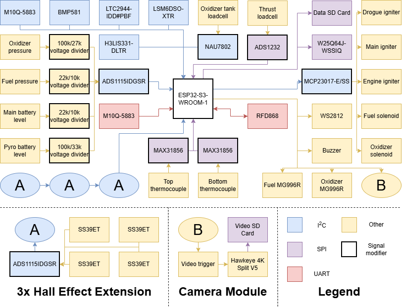
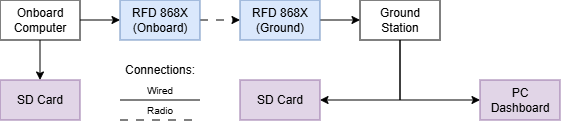

# resat-rocket
All of the code used by the ReSat team during the development of a liquid-propellant rocket.

# Dynamometer

The *dynamometer* directory contains the code used during the engine test campaign. This includes C++ programs meant to be flashed onto the onboard and ground station microcontrollers, a C++ program mean to emulate a properly working ground station for testing purposes, and a Python script, which is to be executed on a seperate computer connected via USB to the ground station.

## Aim 

The aim of the onboard microntroller (onboardDynamometer.ino) code is to:
* control the fuel and oxidizer supply
* ignite the engine to begin combustion
* collect data from several peripherals and sensors described in the next section
* save all of the information on a SD-card
* send the data to the ground station via telemetry

The aim of the ground station microcontroller (groundStationDynamometer.ino) code is to:
* receive the telemetry data from the onboard microcontroller
* parse the telemetry data
* check for and deal with corrupt data packets or errors in transmission
* save the information on a SD-card for redundancy
* send the data to the computer via a USB connection

The aim of the computer dashboard (computerDashboard.py) code is to:
* read the incoming data from a serial connection
* display the readings in a GUI

## Hardware

The .ino files will run on custom made PCBs operating on the ESP32-S3-WROOM-1(N8R8) microcontroller. The board will receive data from the peripherals described in Table 1.

|Name|Description|Through|Communication protocol|
|----|----|----|----|
|Thrust loadcell|Measures the thrust|ADS1232|SPI|
|MH-series loadcell|Measures the weight of the oxidizer tank|NAU7802|I2C|
|Top thermocouple|Measures the temperature at the top of the engine|MAX31856|SPI|
|Bottom thermocouple|Measures the temperature at the bottom of the engine|MAX31856|SPI|
|RFD868 radio interface|Enables two-way communication with the ground station|-|UART|
|M10Q-5883 GPS|Provides geolocation data|-|I2C|
|M10Q-5883 GPS|Provides redundant geolocation data|-|UART|
|LTC2944IDD#PBF battery level sensor|Measures the main battery level|-|I2C|
|BMP581 pressure sensor|Measures atmospheric pressure|-|I2C|
|LSM6DSOXTR 6-axis IMU|Measures acceleration and angular velocity|-|I2C|
|H3LIS331DLTR high-g accelerometer|Measures acceleration for redundancy|-|I2C|
|Main battery voltage|Measures the voltage across the main battery|100k/27k voltage divider & ADS1115IDGSR|I2C|
|Fuel pressure transducer|Measures the fuel pressure|22k/10k voltage divider & ADS1115IDGSR|I2C|
|Oxidizer pressure transducer|Measures the oxidizer pressure|22k/10k voltage divider & ADS1115IDGSR|I2C|
|Pyro battery voltage|Measures the voltage across the pyro battery|100k/33k voltage divider & ADS1115IDGSR|I2C|
|External piston location module|Measures the location of the piston in the tank|ADS1115IDGSR|I2C|

**Table 1**: Dynamometer PCB input peripherals

The external piston location module will be comprised of 3 Hall effect extensions. Each extension consists of an ADS1114IDGSR ADC taking input from 4 SS39ET Hall effect sensors. The first of these is directly connected to the main PCB through I2C, with the other 2 being chained together with the first, to allow for full access to all 12 sensors. The piston moving within the tank has a magnet inside of it and the Hall effect sensors are spaced apart from eachother, spanning the length of the piston path. This allows the location of the piston to be gauged by measuring where the Hall effect is the strongest. 

The MCU will also output data to the peripherals described in Table 2.

|Name|Description|Through|Communication protocol|
|----|----|----|----|
|MG966R fuel valve servo|Opens and closes the fuel valve|-|PWM|
|MG966R oxidizer valve servo|Opens and closes the oxidizer valve|-|PWM|
|SD-card interface|Allows for storing long-term data|-|SPI|
|W25Q64JWSSIQ flash memory|Allows for storing current data and buffering SD-card input|-|SPI|
|RFD868 radio interface|Enables two-way communication with the ground station|-|UART|
|Hawkeye 4K Split V5 camera module|Triggers the video camer to start recording|-|GPIO|
|Huaneng QMB-09B-03 buzzer|Triggers the buzzer for easier recovery|-|GPIO|
|WS2812 LED interface|Displays status and enables easier recovery|-|GPIO|
|Main igniter|Ignites a small combustion charge to release the main parachute|MCP23017-E/SS|I2C| 
|Drogue igniter|Ignites a small combustion charge to release the drogue parachute|MCP23017-E/SS|I2C| 
|Engine igniter|Ignites the engine|MCP23017-E/SS|I2C| 
|Fuel solenoid valve|Controls the flow of fuel to the engine|MCP23017-E/SS|I2C| 
|Oxidizer solenoid valve|Controls the flow of oxidizer to the engine|MCP23017-E/SS|I2C| 

**Table 2**: Dynamometer PCB output peripherals

The information presented above is summarized in the diagram in Figure 1.

**Figure 1**: Data handling diagram for the dynamometer PCB

## Software Architecture

The onboard computer relies on a three-layered tick structure:
|Name|Frequency [Hz]|Time interval [ms]|Actions|
|-|-|-|-|
|Fast (master) tick|50|20|Read Tier A sensors and construct MiniFrame|
|Slow tick|25|40|Read Tier B sensors, construct TelemetryFrame, write telemetry to radio buffer|
|House tick|5|200|Read Tier C sensors|-|

The master tick is implemented using the `ticker` namespace, whose implementation is based on the built-in `esp_timer`. 

Each data packet contains the following sensor readings, all saved as C++ floats and seperated by a semicolon (;):
* time
* thrust
* oxidizer pressure
* fuel pressure
* temperature top
* temperature middle
* temperature bottom
* photoresistor
* hall effect sensors (not implemented yet)

Additonally, at the ground station the following values will be attached, before being sent to the computer dashboard:
* received signal strength indicator

The data will be transfered between components as displayed in the diagram below.

## Dependencies

For dummySerialCode.ino, onboardDynamometer.ino, and groundStationDynamometer.ino:
* This project was coded in Arduino IDE using the esp32 board library by Espressif (for a step-by-step setup process consult the [link](https://dronebotworkshop.com/esp32-intro/))

For computerDashboard.py:
* PySide6
* pyqtgraph
* pySerial